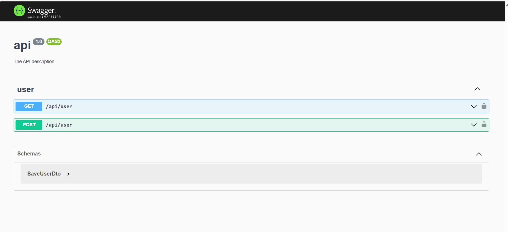
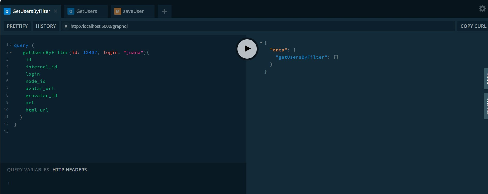
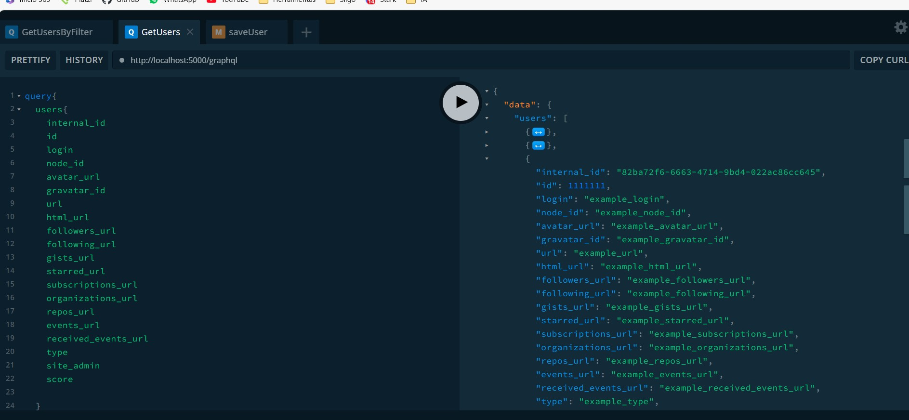
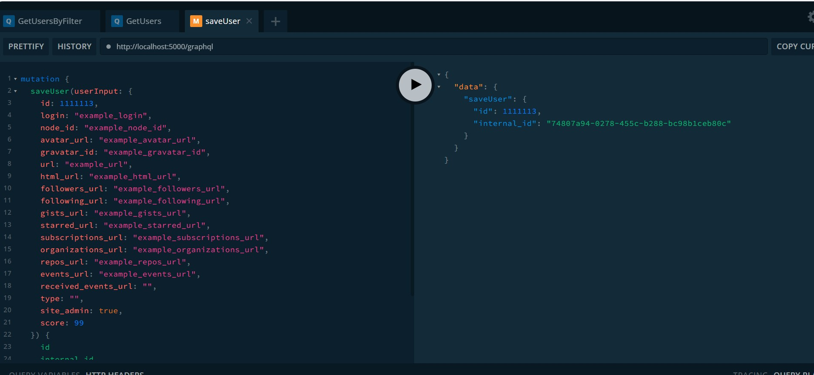

# Web App for Course Selection
## Business requirements
The present web API application was developed by JP with the aim of creating github users!

## Technichal spefications
[](https://en.wikipedia.org/wiki/Hexagonal_architecture_(software)#:~:text=The%20hexagonal%20architecture%20divides%20a,to%20the%20traditional%20layered%20architecture.)
For the implementation of this application, the NestJS framework for Node.js was utilized. NestJS provides a modular and scalable architecture for web applications. Additionally, the application follows the hexagonal architecture, also known as ports and adapters, which separates the business logic from the technical implementation and focuses on the problem domain.

The development approach employed was Domain-Driven Design (DDD), which emphasizes a deep understanding of the business and the modeling of domain objects. This approach results in more flexible, maintainable, and scalable software. By combining these tools and approaches, a robust and scalable application that meets the business requirements was achieved.

In the infrastructure layer, the TypeORM framework was used for handling the database's data model.


## Running the app

```bash

##Set up database local with docker-compose (you can edit credentials and ports in docker-compose.yml file)
$ docker-compose up -d ## (set up postgres and pgadmin)

# development
$ npm run start

# watch mode
$ npm run start:dev

# production mode
$ npm run start:prod

important: you need a database connection for typeorm, I used postgres sql, but you are free to decide what you want 
```

## Consumning the app
this app can be consumed using both (rest http/graphql request) 

### Consuming using http
Please open http://localhost:5000/api/ and you can see something like this 
[](#)
this is the defition http request example to consume the endpoints


### Consuming using graphql
Please open http://localhost:5000/graphql and you can see something like this 
[](#)
[](#)
[](#)


this is the defition graphql request example to consume the mutations and queries
## Test

```bash
# unit tests
$ npm run test

# e2e tests
$ npm run test:e2e

# test coverage
$ npm run test:cov
```

## Stay in touch

- Author  - Juan Pablo meza (Flexuxs)
- github  - [juanpablomg17](https://github.com/juanpablomg17)
- Twitter - [@GazabonJuan](https://twitter.com/GazabonJuan)

## License

[MIT licensed](LICENSE).

